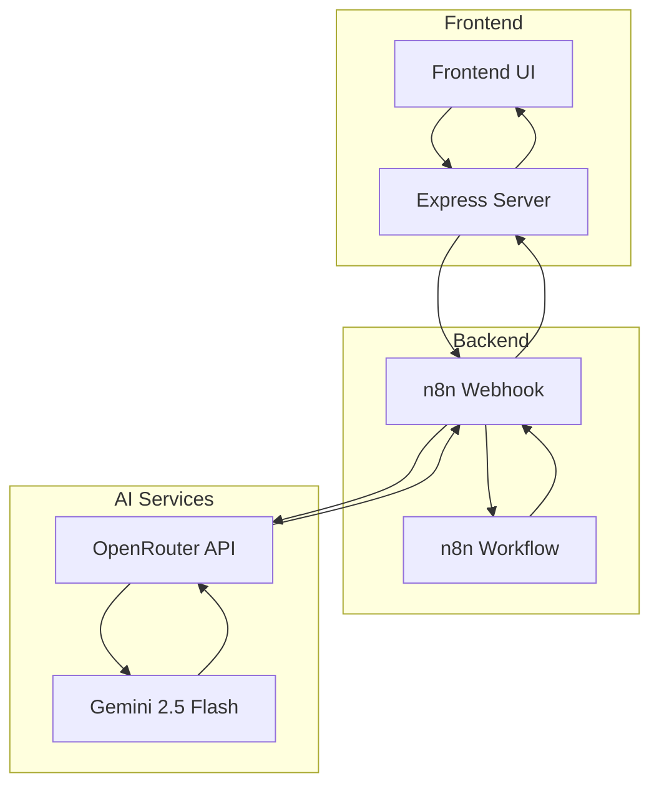

# StockArt AI Chat

A full-stack AI-powered chat application for stock market analysis and discussion. Built with a modern frontend and n8n workflow backend, integrating with OpenRouter API using Gemini 2.5 Flash model.

## 🌟 Features

- **Perplexity-inspired UI**: Clean, modern interface with responsive design
- **AI-Powered Chat**: Advanced conversational AI using Gemini 2.5 Flash
- **Stock Market Focus**: Specialized for financial discussions and stock analysis
- **Real-time Communication**: WebSocket-based chat with typing indicators
- **Mobile Optimized**: Touch-friendly interface with gesture support
- **Dark/Light Theme**: Automatic theme detection with manual override
- **Railway Ready**: Pre-configured for easy deployment

## 🏗️ Architecture



## 📁 Project Structure

```
stockart-ai-chat/
├── README.md                 # This file
├── frontend/                 # Frontend application
│   ├── index.html           # Main HTML file
│   ├── server.js            # Express server
│   ├── package.json         # Frontend dependencies
│   ├── Dockerfile           # Frontend Docker config
│   ├── railway.json         # Frontend Railway config
│   ├── scripts/             # JavaScript modules
│   │   ├── config.js        # Configuration management
│   │   ├── chat.js          # Chat functionality
│   │   ├── mobile.js        # Mobile features
│   │   └── main.js          # Main application logic
│   └── styles/              # CSS stylesheets
│       ├── main.css         # Main styles
│       ├── chat.css         # Chat interface
│       ├── mobile.css       # Mobile responsive
│       └── animations.css   # Animations
└── n8n-backend/             # Backend workflow
    ├── stockart-ai-workflow.json  # n8n workflow definition
    ├── Dockerfile           # n8n Docker config
    └── railway.json         # Backend Railway config
```

## 🚀 Quick Start

### Prerequisites

- Node.js 18+ (for frontend)
- Docker (for containerized deployment)
- Railway account (for cloud deployment)
- OpenRouter API key
- n8n instance or Railway deployment

### Local Development

1. **Clone the repository**
```bash
git clone <repository-url>
cd stockart-ai-chat
```

2. **Set up the frontend**
```bash
cd frontend
npm install
export N8N_WEBHOOK_URL="your-n8n-webhook-url"
npm run dev
```

3. **Set up the n8n backend**
   - Import the workflow from `n8n-backend/stockart-ai-workflow.json`
   - Configure your OpenRouter API key
   - Set the webhook URL in your frontend configuration

### Railway Deployment

#### Deploy Frontend

1. Create a new Railway project
2. Connect your Git repository
3. Set the root directory to `frontend`
4. Add environment variables:
   - `N8N_WEBHOOK_URL`: Your n8n webhook URL
5. Deploy automatically via Git

#### Deploy n8n Backend

1. Create another Railway service
2. Set the root directory to `n8n-backend`
3. Add environment variables:
   - `OPENROUTER_API_KEY`: Your OpenRouter API key
   - `N8N_ENCRYPTION_KEY`: Random 32-character string
4. Import the workflow after deployment

## 🔧 Configuration

### Frontend Environment Variables

```bash
NODE_ENV=production          # Environment mode
PORT=3000                   # Server port
N8N_WEBHOOK_URL=            # Backend webhook URL
```

### Backend Environment Variables

```bash
N8N_ENCRYPTION_KEY=         # 32-character encryption key
OPENROUTER_API_KEY=         # OpenRouter API key
N8N_PORT=5678              # n8n port
N8N_PROTOCOL=http          # Protocol (http/https)
N8N_HOST=localhost         # Host
```

## 🔗 API Integration

### Frontend to Backend Communication

The frontend communicates with the n8n backend via webhook:

```javascript
// Chat API endpoint
POST /webhook/stockart-chat

// Request payload
{
  "message": "Tell me about AAPL stock",
  "conversationId": "optional-conversation-id"
}

// Response
{
  "response": "Apple Inc. (AAPL) is...",
  "conversationId": "generated-or-existing-id"
}
```

### OpenRouter Integration

The n8n workflow uses OpenRouter to access Gemini 2.5 Flash:

```json
{
  "model": "google/gemini-2.0-flash-exp:free",
  "messages": [
    {
      "role": "system",
      "content": "You are a financial AI assistant..."
    },
    {
      "role": "user", 
      "content": "User's question about stocks"
    }
  ]
}
```

## 🎨 Design System

### Color Palette

- **Primary**: `#4a9eff` (Blue)
- **Secondary**: `#00d4aa` (Teal)
- **Success**: `#51cf66` (Green)
- **Error**: `#ff6b6b` (Red)
- **Warning**: `#ffd43b` (Yellow)

### Typography

- **Primary Font**: Inter, system fonts
- **Font Sizes**: 12px - 30px responsive scale
- **Line Height**: 1.6 for optimal readability

### Responsive Breakpoints

- **Mobile**: < 768px
- **Tablet**: 768px - 1024px
- **Desktop**: > 1024px

## 🧪 Testing

### Frontend Testing

```bash
cd frontend
npm test              # Run test suite
npm run test:coverage # Generate coverage report
npm run test:e2e      # End-to-end tests
```

### Manual Testing Checklist

- [ ] Chat functionality works
- [ ] Responsive design on all devices
- [ ] Dark/light theme switching
- [ ] Accessibility features
- [ ] API error handling
- [ ] Mobile gestures

## 📦 Production Deployment

### Docker Deployment

1. **Build and run frontend**
```bash
cd frontend
docker build -t stockart-frontend .
docker run -p 3000:3000 -e N8N_WEBHOOK_URL="your-url" stockart-frontend
```

2. **Build and run backend**
```bash
cd n8n-backend
docker build -t stockart-backend .
docker run -p 5678:5678 -e OPENROUTER_API_KEY="your-key" stockart-backend
```

### Railway Deployment

1. **Frontend**: Deploy from `frontend/` directory
2. **Backend**: Deploy from `n8n-backend/` directory
3. **Environment Variables**: Set via Railway dashboard
4. **Custom Domains**: Configure in Railway settings

## 🔒 Security Considerations

- **API Keys**: Never expose in frontend code
- **CORS**: Properly configured for production domains
- **Rate Limiting**: Implemented on API endpoints
- **Input Validation**: Sanitized user inputs
- **HTTPS**: Enforced in production

## 🤝 Contributing

1. Fork the repository
2. Create a feature branch (`git checkout -b feature/amazing-feature`)
3. Commit your changes (`git commit -m 'Add amazing feature'`)
4. Push to the branch (`git push origin feature/amazing-feature`)
5. Open a Pull Request

### Development Guidelines

- Follow existing code style
- Add tests for new features
- Update documentation
- Ensure responsive design
- Test on multiple devices

## 📄 License

This project is licensed under the MIT License - see the [LICENSE](LICENSE) file for details.

## 🆘 Support

- **Issues**: GitHub Issues for bug reports
- **Discussions**: GitHub Discussions for questions
- **Documentation**: See README files in each directory

## 🚀 Roadmap

- [ ] User authentication system
- [ ] Real-time stock price integration
- [ ] Portfolio tracking features
- [ ] Advanced charting capabilities
- [ ] Push notifications
- [ ] Mobile app (React Native)
- [ ] API rate limiting dashboard
- [ ] Advanced AI model selection

---

**Built with ❤️ for the financial community**
